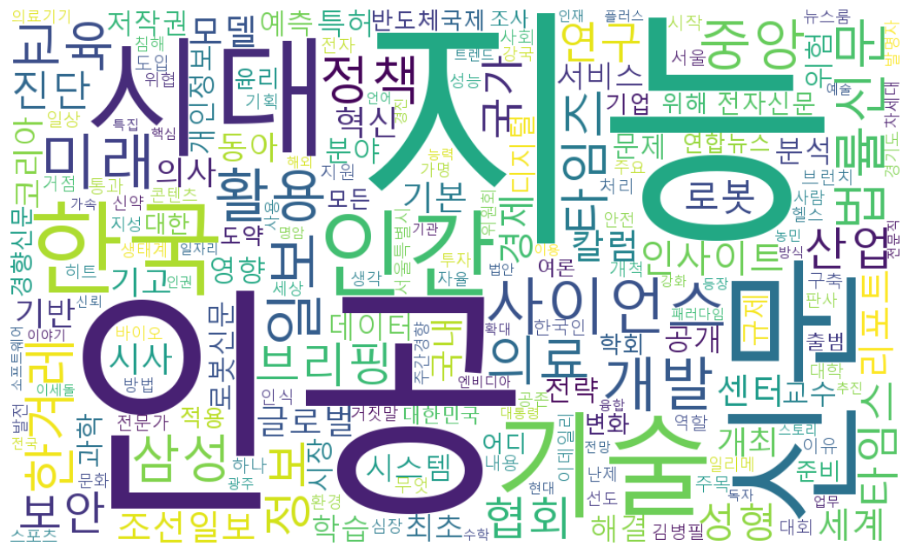

# Creating a Word Cloud Using Google Trends Data

## 1. Project Overview
본 프로젝트는 Google News 데이터를 활용하여 특정 키워드와 관련된 뉴스 제목을 수집하고,  
한국어 자연어 처리(KoNLPy)를 통해 단어를 정제·토큰화한 뒤  
워드 클라우드 형태로 시각화하는 오픈소스 프로젝트입니다.

데이터 수집 → 전처리 → 시각화까지의 전체 파이프라인을  
팀원별 역할 분담과 GitHub Pull Request 기반 협업 방식으로 구현하였습니다.

---

## 2. Demo Result
아래 이미지는 최종 생성된 워드 클라우드 결과입니다.



---

## 3. Used Packages & Environment
- Python 3.11
- requests
- beautifulsoup4
- pandas
- konlpy
- jpype1
- wordcloud
- matplotlib

> ⚠️ KoNLPy 사용을 위해 Java(JDK 17 이상)가 필요합니다.

---

## 4. How to Run

### (1) Data Collection
Google News RSS를 이용하여 분기별 뉴스 데이터를 수집합니다.

```bash
python 202534728_김규림_datacode.py
````

실행 결과:

* `collected_data/` 디렉토리에 JSON 파일 생성

---

### (2) Data Preprocessing

수집된 뉴스 제목을 정제하고 형태소 분석을 통해 명사만 추출합니다.

```bash
python preprocess_byungjun.py
```

실행 결과:

* `final_tokenized_words.txt` 생성

---

### (3) Word Cloud Generation

전처리된 단어 데이터를 이용해 워드 클라우드를 생성합니다.

```bash
python 202534823_박진환_Making_wordcloud.py
```

실행 결과:

* `wordcloud_outputs/wordcloud_all.png` 생성

---

## 5. Directory Structure

```
.
├─ collected_data/                 # 수집된 뉴스 데이터 (JSON)
├─ wordcloud_outputs/
│  └─ wordcloud_all.png             # 최종 워드클라우드 이미지
├─ final_tokenized_words.txt        # 전처리 결과 텍스트
├─ preprocess_byungjun.py           # 데이터 전처리 코드
├─ 202534728_김규림_datacode.py      # 데이터 수집 코드
├─ 202534823_박진환_Making_wordcloud.py # 워드클라우드 생성 코드
└─ README.md
```

---

## 6. Team Collaboration (Pull Request Workflow)

본 프로젝트는 GitHub Pull Request 기반 협업 방식으로 진행되었습니다.

* 각 팀원은 개별 feature 브랜치에서 작업
* 기능 단위별 커밋 후 Pull Request 생성
* main 브랜치로 병합하여 최종 결과 반영

이를 통해 작업 이력(commit history)과 협업 과정을 명확히 관리하였습니다.

---

## 7. References

* Google News RSS
* KoNLPy Documentation
* WordCloud Python Library

```

